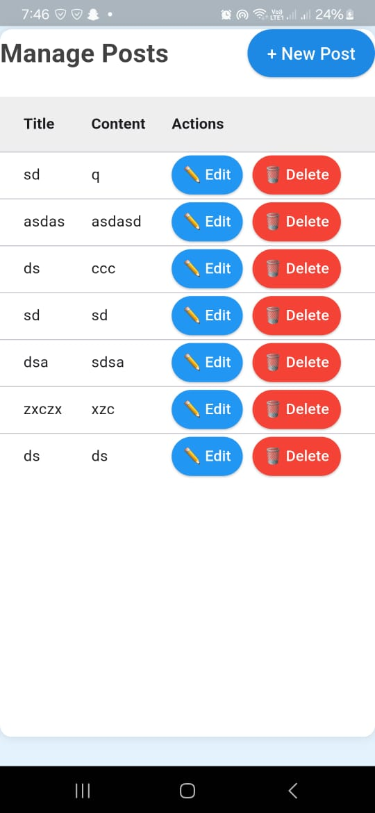
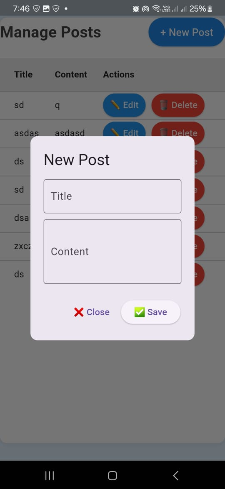
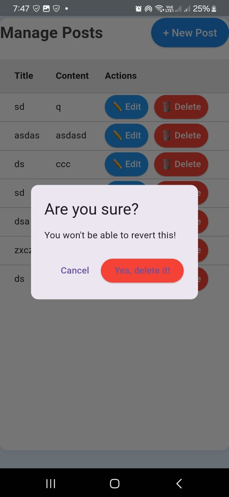

# aixs crud flutter

This is a simple **Post Management System** built using **Flutter**.  
It follows the **Domain-Driven Design (DDD)** approach and integrates with an **HTTP API** for managing posts.

## Features

- ✅ Create, edit, and delete posts.
- ✅ Uses **Flutter Bloc** for state management.
- ✅ Implements **DDD** for better code organization and maintainability.
- ✅ Provides an **HTTP API** to interact with posts.
- 🚫 No authentication or authorization, as this is a simple test project.

## Images







## Installation

1. Clone the repository:
   ```sh
   git clone https://github.com/yourusername/flutter_ddd_post.git
   cd flutter_ddd_post
